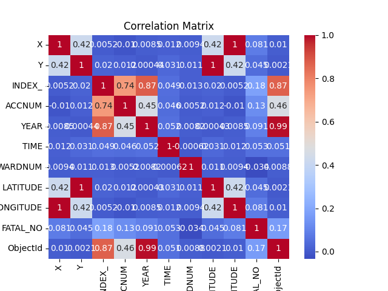
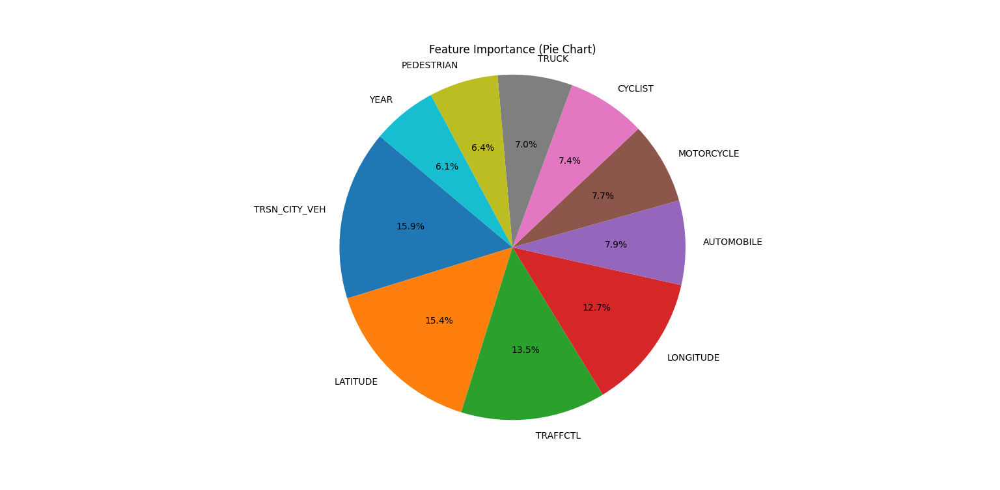

# Accident Prediction Model

Welcome to the Accident Prediction Model project! This repository showcases an end-to-end machine learning solution for analyzing and predicting traffic collisions using historical data.

---

## 📊 Project Description

The Accident Prediction Model utilizes machine learning techniques to analyze traffic incident data and predict potential accident patterns. The insights derived from this project aim to help urban planners, policymakers, and transportation authorities reduce accidents and enhance road safety.

---

## ✨ Features of the Project

- **Data Preprocessing:** Cleaning and preparing raw traffic data for analysis.
- **Exploratory Data Analysis (EDA):** Visualizations to identify trends and patterns in accident data.
- **Machine Learning Models:** Predictive models built using algorithms such as Logistic Regression, Random Forest, and Gradient Boosting.
- **Evaluation Metrics:** Performance evaluation using metrics like accuracy, precision, recall, and F1-score.
- **Interactive Dashboard:** Visual representation of predictions and trends.

---

## 🖼️ Screenshots




> Additional visuals and reports can be found in the project files.

---

## 🛠️ Tools and Tech Stack

- **Python:** Core programming language for data analysis and model development.
- **Libraries:** Pandas, NumPy, Matplotlib, Seaborn, Scikit-learn, XGBoost.

---

## 📌 Required Dependencies:
```
pandas==1.5.3
numpy==1.23.4
matplotlib==3.7.1
seaborn==0.12.2
scikit-learn==1.2.1
xgboost==1.7.5
```
---

## 📂 Project Structure
- Backend/
    - data/: Contains raw and cleaned traffic data.
    - models/: Saved machine learning models.
    - requirements.txt: Dependencies for the project.
    - **KSI_prediction_model.py** is the python script 

- Frontend/
    - static/assests/: images and gifs
    - templates/: 3 web pages (home, predictor, result)
    - app.py: Flask routers

- images/: Screenshots and visual outputs.


## 🚀 How to Run the Project

1. Clone the repository:
   ```bash
   git clone https://github.com/your-username/accident-prediction.git
    ```
2. Navigate to the Backend directory
    ```bash
   cd Backend
    ```
3. Run the Python script **(KSI_prediction_model.py)** for analysis and model training.
4. Run the **app.py** located in Frontend directory. It will run the flask app on localhost port 5000, once it runs successfully you can access it by copy and pasting **```http://127.0.0.1:5000```** to browser.